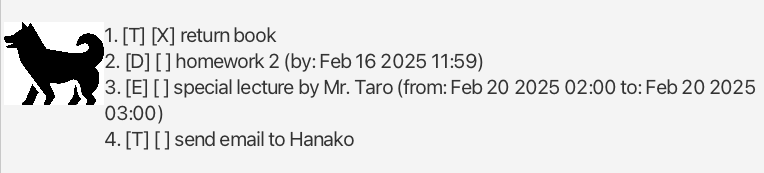

# Pochi User Guide

Struggling to keep track of your tasks? Pochi is here to help! Your friendly chatbot makes your task management effortless through simple chat interactions.

## Adding tasks

### Todos

To add a todo task to your task list, simply send the command: `todo (description)`.

### Deadlines

To add a task with a deadline, use the command: `todo (description) /by (deadline)`.

The `(deadline)` has to follow either of the following formats.

- `yyyy-mm-dd hh:mm`
- `(day) hh:mm`

For the second format, Pochi will automatically set the deadline to the next occurrance of specified `(day)`. For example, if today is Saturday, February 15, 2025, and you enter `Tuesday`, the deadline date will be set to Tuesday, February 18, 2025.

### Events

To add an event to your task list, use the command: `todo (description) /from (start time) /to (end time)`.

Similar to deadlines, the `(start time)` and `(end time)` have to follow either of the following formats.

- `yyyy-mm-dd hh:mm`
- `(day) hh:mm`

## List up tasks

To view the entire list of your tasks, use the command: `list`.

Pochi will show each task in the following format:

- Todos
  - `(index). [T] [(mark)] (description)`
- Deadlines
  - `(index). [D] [(mark)] (description) (by: (deadline))`
- Events
  - `(index). [E] [(mark)] (description) (from: (start time) to: (end time))`

Refer to the image below for an example:

If the task is marked as completed (see later section), the `(mark)` will be `X`; otherwise, it will be left blank.

## Mark, Unmark, and Delete

Using the indeces given by the `list` command, you can designate a task and:

- mark it as completed with the command: `mark (index)`
- unmark it as incomplete with the command: `unmark (index)`
- delete it from the task list with the command: `delete (index)`

## Find a task

You can also search for a task containing a keyword in its description using the command: `find (keyword)`. Please note that the keyword is case-sensitive (i.e. it distinguishes between uppercase and lowercase letters).

## Logging (performed automatically)

Pochi keeps track of the current status of your task list every time you enter a command. This ensures that your task list information is never lost and will be restored and loaded each time you close and reopen the app (see the picture at the top of this page).

## Finish the dialog session

You can end the conversation with Pochi by using the command: `bye`.